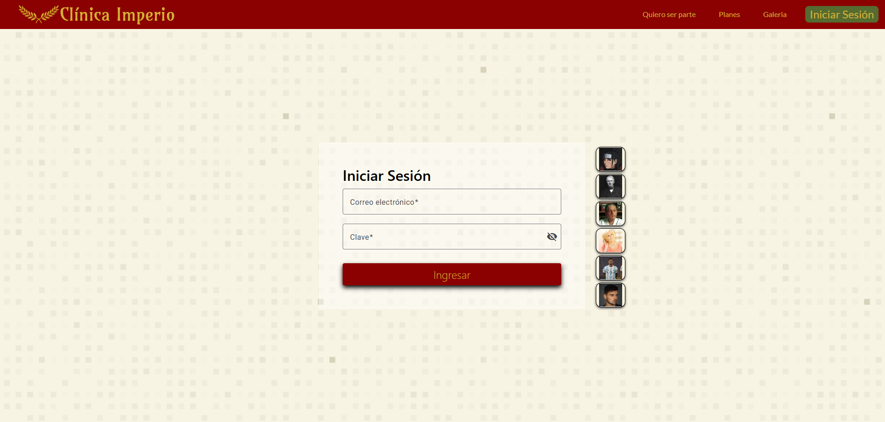
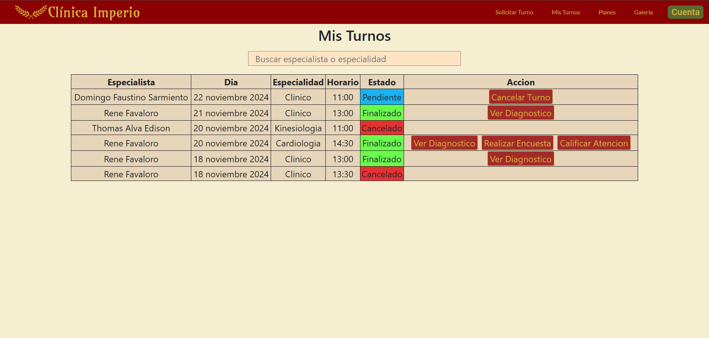
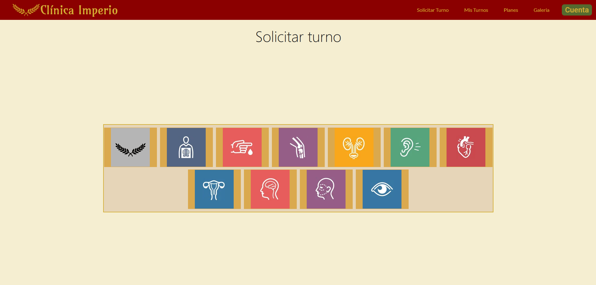
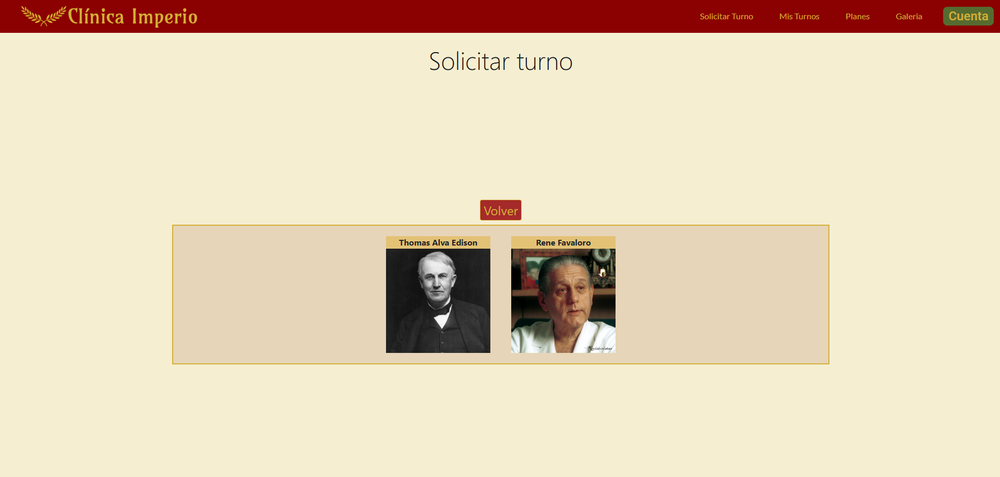
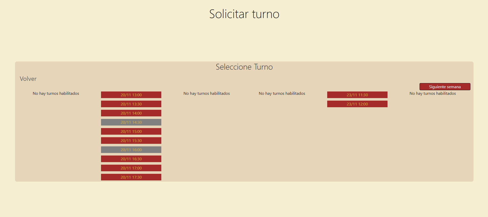
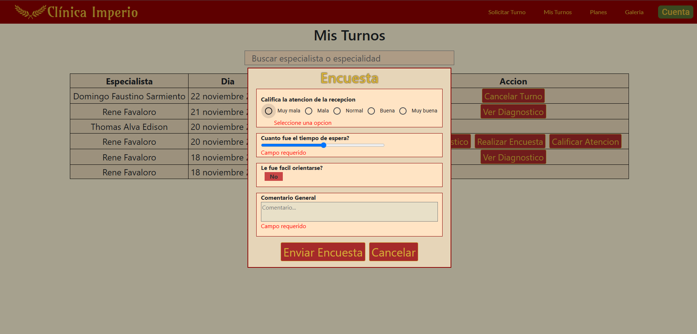
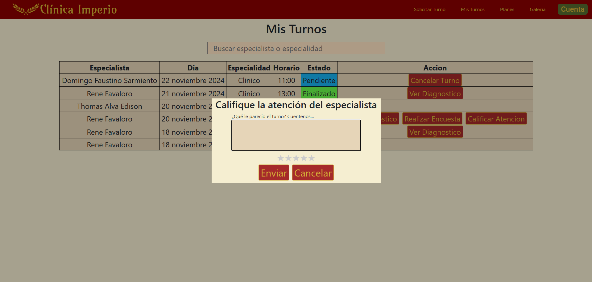
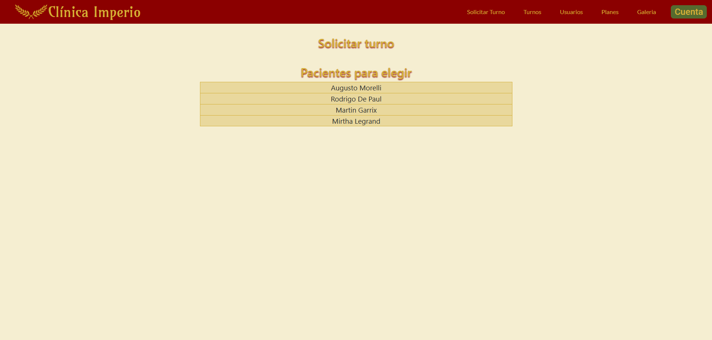
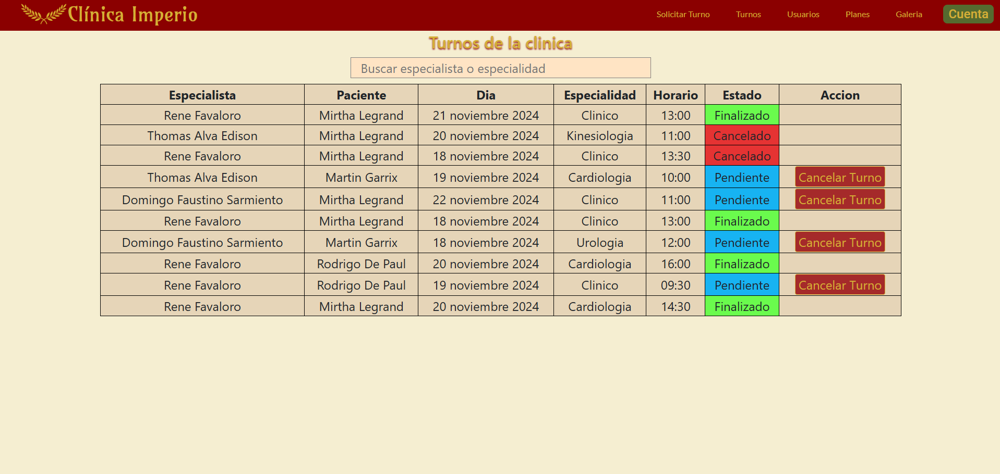

# Clínica Imperial

### Descripción
La Clínica OnLine, especialista en salud, cuenta actualmente con 6 consultorios, dos laboratorios físicos en
la clínica, y una sala de espera general. Está abierta al público de lunes a viernes de 8:00 a 19:00, y los
sábados de 8:00 a 14:00. En ella trabajan profesionales de diversas especialidades, que ocupan los
consultorios acorde a su disponibilidad, recibiendo pacientes con turno para consulta o tratamiento. Los
turnos son solicitados a través de la web, seleccionando el profesional o la especialidad.

### Logo

### Página de bienvenida

### Quiero ser parte   
Aqui el usuario deberá elegir si es Cliente o Especialista para registrarse

### Registro Cliente

### Registro Especialista

### Iniciar Sesión   
Esta es la sección por la cual ingresaremos al sistema, tanto como si somos Clientes o Especialistas. Para poder ingresar como especialista deberemos verificar nuestro correo electrónico y ademas ser aprobados por un Administrador. Como cliente solo necesitamos verificar nuestro correo electrónico. Tambien tenemos unos usuarios pre-cargados en el sistema para poder iniciar sesión.   

### Mis Turnos Paciente
Como paciente podremos ver todos nuestros turnos pendientes, aceptados, finalizados, rechazados, y aceptados. Aqui tendremos la posibilidad de cancelar el turno si solo esta en pendiente o aceptado por el especialista.

### Solicitar Turno
El paciente puede solicitar un turno primero seleccionando la imagen de la especialidad (de no tener se muestra una por defecto con el logo de la clínica), luego seleccionando el especialista y luego el día y hora.

Luego podremos realizar una encuesta general de la clinica y calificar la atención de la consulta.

### Solicitar Turno Administrador
El administrador puede sacar un turno pero deberá seleccionar primero al paciente al cual quiere generarle un nuevo turno, y luego si el flujo normal de especialidad, especialista, fecha y hora.

### Turnos Administrador
El administrador tambien tiene una sección Turnos de la cual ve todos los turnos de la clínica y puede cancelar los turnos que esten en el estado Pendiente.

