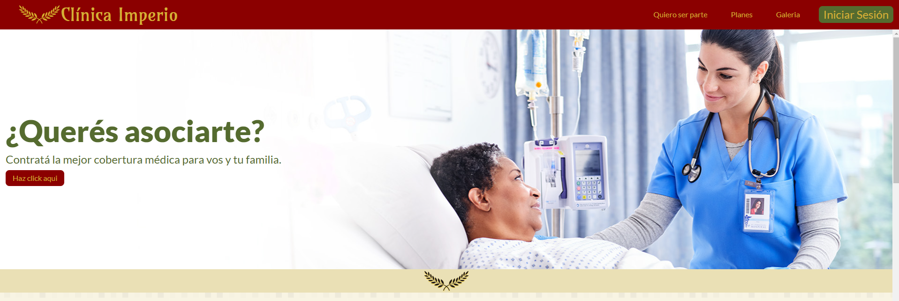
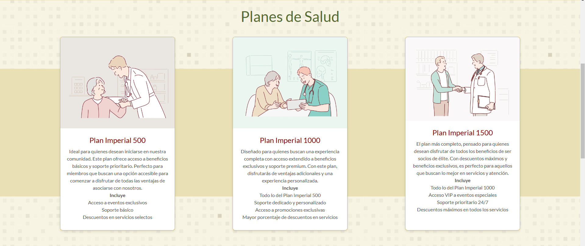
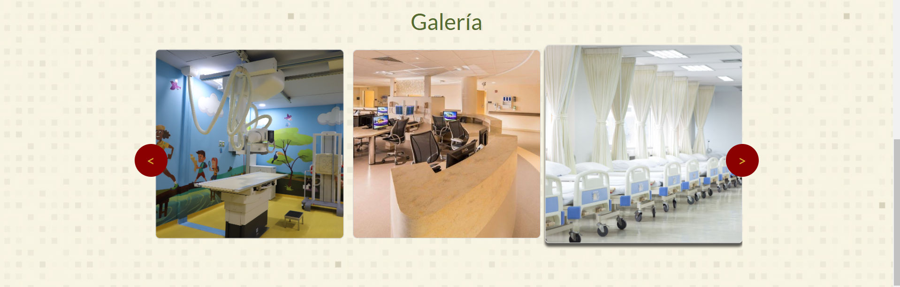
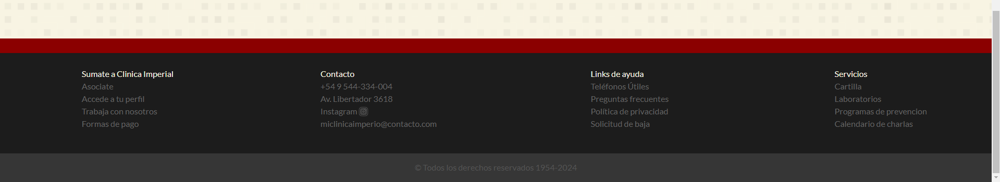
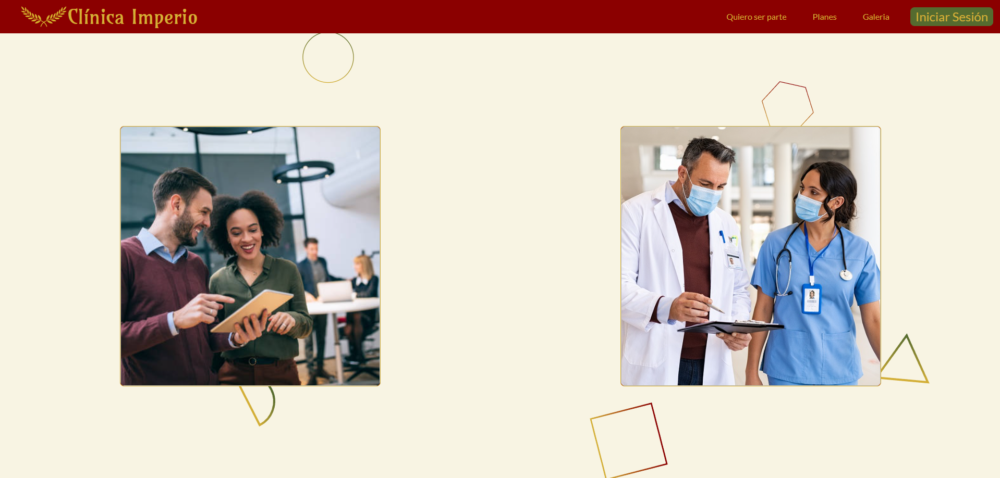
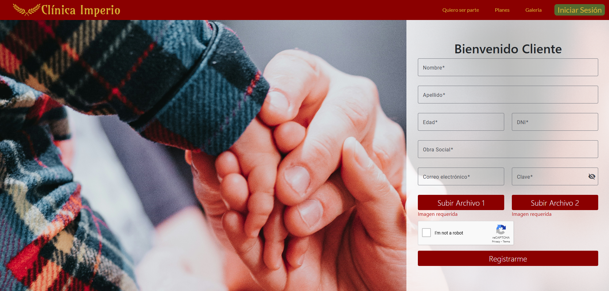
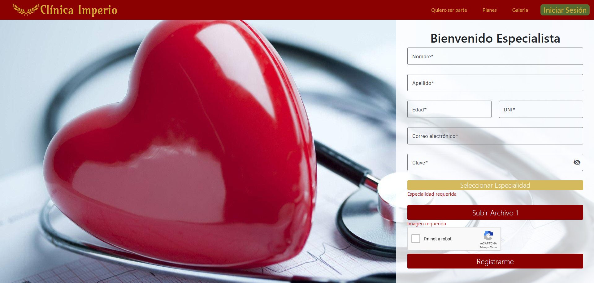

# Clinica Imperial

### Descripcion
La Clínica OnLine, especialista en salud, cuenta actualmente con 6 consultorios, dos laboratorios físicos en
la clínica, y una sala de espera general. Está abierta al público de lunes a viernes de 8:00 a 19:00, y los
sábados de 8:00 a 14:00. En ella trabajan profesionales de diversas especialidades, que ocupan los
consultorios acorde a su disponibilidad, recibiendo pacientes con turno para consulta o tratamiento. Los
turnos son solicitados a través de la web, seleccionando el profesional o la especialidad.

### Logo

### Pagina de bienvenida

### Quiero ser parte

### Registro Cliente

### Registro Especialista

